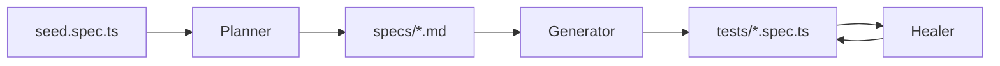
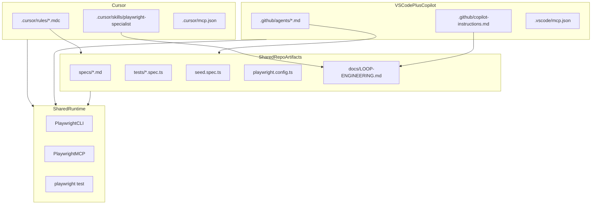
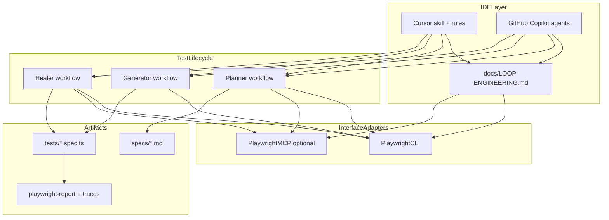

# Playwright Specialist Agent Platform (Loop Engineering)

> **Navigation:** [Documentation map](./README.md) · **Daily use:** [LOOP-ENGINEERING.md](./LOOP-ENGINEERING.md)  
> This file is the long-form platform plan and external research archive.

> Last updated: 2026-07-01

Research below uses **public docs and web sources only** — no local repos or laptop files.

**Core principle:** the platform is built with **Loop Engineering** — not one-shot prompts. Agents act, observe, verify, and repeat until verifiable goals are met or guardrails stop the loop.

## Table of contents

1. [Implementation checklist](#implementation-checklist)
2. [Loop Engineering — Core Architecture](#loop-engineering--core-architecture)
3. [What Playwright Specialist Agent Means in 2026](#what-playwright-specialist-agent-means-in-2026)
4. [External agent research](#existing-playwright-agents-with-autonomous-capabilities-external-research)
5. [Official Test Agent Lifecycle](#official-test-agent-lifecycle)
6. [Multi-IDE Support](#multi-ide-support-cursor--vs-code--github-copilot)
7. [Project layout](#project-layout)
8. [Implementation phases](#implementation-phases)
9. [Example end-to-end flow](#example-end-to-end-flow-loop-engineering)
10. [Risks, success criteria, references](#key-risks-and-mitigations)

## Implementation checklist

- [x] **Phase 1:** Init poc, Playwright + CLI, seed test; `init-agents --loop=copilot`; `.loop/` state dir (Cursor rules manual — no `--loop=cursor` in Playwright 1.58+)
- [x] **Phase 2:** Author `docs/LOOP-ENGINEERING.md` + `docs/LOOP-ENGINEERING.md`; Cursor skill + Copilot instructions
- [x] **Phase 3:** `scripts/loop.sh` + `npm run loop`; plan/generate/heal helpers; dual-IDE README
- [x] **Phase 4:** MCP in `.vscode/mcp.json` + `.cursor/mcp.json`; trace-on-retry; loop state logging
- [x] **Phase 5:** CI verification gate; healer max-retries in docs; artifact upload
- [x] **Phase 6:** Stagehand agent-server (`packages/agent-server`), HTTP API, web UI
- [x] **Phase 7:** Auto-loop (bridge → generate → verify → heal) + memory at level 4 — see [AUTONOMOUS-AGENT.md](./AUTONOMOUS-AGENT.md)

---

## Loop Engineering — Core Architecture

Operational rules, phase prompts, and templates live in **[LOOP-ENGINEERING.md](./LOOP-ENGINEERING.md)** — the single canonical loop guide.

Summary:

- **Master loop:** Plan → Generate → Run → Heal → Verify with explicit gates between phases
- **Sub-loops:** Planner explore, Generator verify-selectors, Healer fix (max 3 attempts)
- **State:** `.loop/run-log.json`, `.loop/last-run.json`, optional `.loop/goals.md`
- **Two meanings of "loop":** loop engineering (methodology) vs `init-agents --loop=copilot` (IDE binding)

Sources: [MindStudio — Loop Engineering](https://www.mindstudio.ai/blog/what-is-loop-engineering-ai-coding-agents), [Playwright Test Agents](https://playwright.dev/docs/test-agents).

---

## What "Playwright Specialist Agent" Means in 2026

Microsoft and the Playwright ecosystem now expose **three complementary layers**, not one tool:

| Layer | What it is | Best for |
|-------|------------|----------|
| **Test Agents** (Planner / Generator / Healer) | Prompt + tooling definitions generated by `init-agents` | End-to-end test lifecycle: explore app → write plan → generate `.spec.ts` → fix failures |
| **Playwright CLI + Skills** (`@playwright/cli`) | Shell commands + `SKILL.md` manifest | Coding agents (Cursor, VS Code Copilot, Claude Code) with filesystem access — **default for day-to-day work** |
| **Playwright MCP** (`@playwright/mcp`) | Stateful browser tools over MCP | Exploratory loops, deep page introspection, sandboxed agents without shell |

**Recommendation for your full platform:** use **Loop Engineering** as the orchestration model, **CLI + Skills** as the primary runtime inside each loop iteration, **official Test Agents** for Planner / Generator / Healer phases, and **MCP** for explore/heal sub-loops when iterative browser reasoning is needed.

Sources: [Playwright Test Agents](https://playwright.dev/docs/test-agents), [Playwright CLI for coding agents](https://playwright.dev/docs/getting-started-cli), [Playwright MCP](https://playwright.dev/docs/getting-started-mcp), [playwright-cli repo](https://github.com/microsoft/playwright-cli), [playwright-mcp repo](https://github.com/microsoft/playwright-mcp).

---

## Existing Playwright Agents with Autonomous Capabilities (External Research)

Not all "Playwright agents" are the same. They sit on an **autonomy spectrum**:

| Level | Behavior | Examples |
|-------|----------|----------|
| **Tool layer** | LLM calls browser tools step-by-step; human or outer agent drives the loop | Playwright MCP, Playwright CLI |
| **Lifecycle agents** | Scoped autonomy within test authoring/maintenance (plan → code → heal) | Official Planner / Generator / Healer |
| **Hybrid autonomy** | Deterministic Playwright code + AI invoked only where needed; optional full agent loop | Stagehand, Notte, HyperAgent |
| **Full autonomy** | Goal in, agent plans/navigates/clicks until done or stuck | Browser Use, Skyvern, LaVague |

Below is a catalog of **existing, publicly available** options (no local repos consulted).

### 1. Official Playwright (Microsoft) — lifecycle autonomy, not open-ended tasks

| Product | Autonomous? | What it does |
|---------|-------------|--------------|
| **[Planner / Generator / Healer](https://playwright.dev/docs/test-agents)** | Partial — scoped to test lifecycle | Planner explores app and writes `specs/*.md`; Generator produces `.spec.ts`; Healer replays failures, patches locators, re-runs until pass or skip |
| **[Playwright MCP](https://playwright.dev/docs/getting-started-mcp)** | No — tool server | 40+ browser tools over MCP; outer LLM/agent decides each step |
| **[Playwright CLI + Skills](https://playwright.dev/docs/getting-started-cli)** | No — command interface | Token-efficient shell commands for coding agents; supports plan/generate/heal workflows when combined with agent prompts |

**Healer is the most "autonomous" official agent:** it runs a fix loop (replay → inspect UI/trace → patch → re-run) with guardrails. Planner and Generator are autonomous within their phase but produce **artifacts** (plans, tests), not arbitrary web tasks.

Bootstrap (per IDE): `init-agents --loop=cursor` for Cursor; `init-agents --loop=copilot` (or `--loop=vscode`) for VS Code + GitHub Copilot. As of Playwright 1.59+, `copilot` and `vscode` produce identical output.

### 2. Hybrid frameworks — Playwright + selective or full agent loops

These extend Playwright with LLM-driven actions while keeping deterministic code as an escape hatch.

| Framework | Language | Playwright role | Autonomous mode | Notable features |
|-----------|----------|-----------------|-----------------|------------------|
| **[Stagehand](https://github.com/browserbase/stagehand)** | TS, Python | Core engine | `agent.execute(task)` — multi-step autonomous workflow | `act()`, `extract()`, `observe()` for surgical AI; action caching / self-healing on repeat runs; Browserbase cloud option |
| **[Browser Use](https://github.com/browser-use/browser-use)** | Python | Underlying driver | Full agent loop — observe → plan → act → repeat | 18+ LLM providers; planning, memory, loop detection; best for open-ended goals ("research competitors", "fill this form") |
| **[Notte](https://github.com/nottelabs/notte)** | Python | Compatible primitives | `run()` natural-language web agents | Hybrid: script deterministic steps, agent only where needed; stealth sessions, vaults, CAPTCHA handling (hosted tier) |
| **[HyperAgent](https://www.npmjs.com/package/@hyperbrowser/agent)** (`@hyperbrowser/agent`) | TypeScript | Integrated with Playwright API | `page.ai()`, `executeTask()` | Action caching for deterministic replay; CDP-native; stealth; cloud via Hyperbrowser |
| **[Midscene](https://github.com/web-infra-dev/midscene)** | JS/TS | Integrates with Playwright/Vitest | Skills + MCP for agent-driven testing | Vision-first (`aiAct`, `aiQuery`, `aiAssert`); works when a11y tree is insufficient |
| **[LaVague](https://github.com/lavague-ai/LaVague)** | Python | Playwright or Selenium driver | `WebAgent.run(objective)` | World Model + Action Engine; pluggable LLMs; LaVague QA for Gherkin → tests |

**Stagehand vs Browser Use (common trade-off):**
- **Stagehand** — you own the script; AI fills gaps; `agent()` for end-to-end flows; best for **maintained production automations**
- **Browser Use** — you give a goal; the model owns the journey; best for **exploratory or unpredictable multi-step tasks**

Sources: [Stagehand docs](https://docs.stagehand.dev/), [NxCode comparison](https://www.nxcode.io/resources/news/stagehand-vs-browser-use-vs-playwright-ai-browser-automation-2026), [browserbash framework comparison](https://browserbash.com/blog/stagehand-vs-browser-use-vs-skyvern).

### 3. Vision-first / workflow platforms — high autonomy, often Playwright-backed

| Framework | Language | Architecture | Best for |
|-----------|----------|--------------|----------|
| **[Skyvern](https://github.com/Skyvern-AI/skyvern)** | Python | Planner → Actor → Validator loop; vision + LLM | Form-heavy enterprise portals, 2FA/CAPTCHA flows; ~85.8% WebVoyager benchmark (published) |
| **[Midscene](https://midscenejs.com/)** | JS/TS | Vision-driven UI actions | Canvas-heavy UIs, cross-platform screenshots, YAML or SDK |

Skyvern and Browser Use both target **full workflow autonomy** but differ: Skyvern leans vision + validation gates; Browser Use leans DOM-first agent loop.

### 4. Cloud / SaaS layers — autonomous maintenance on Playwright tests

These are not open-source agent runtimes but add autonomous capabilities on top of Playwright execution:

| Platform | Autonomous capability |
|----------|----------------------|
| **BrowserStack / LambdaTest** | AI Self-Heal / Auto-Heal for Playwright locators during cloud runs |
| **GitHub Copilot Coding Agent** | Uses Playwright MCP to verify PR changes in a real browser |
| **Bug0, Octomind, TestSprite, AgentQL, ZeroStep** | Various NL generation, MCP loops, or `getByAI`-style selectors outputting Playwright code |

These complement — not replace — a specialist agent platform focused on **authoring and local healing**.

### 5. Comparison matrix — which existing agent fits which job

| Job | Best existing option | Why |
|-----|---------------------|-----|
| Plan + generate + heal E2E tests in Cursor | Official Test Agents + MCP/CLI | Purpose-built lifecycle; outputs standard Playwright TS |
| Open-ended web task ("book cheapest flight") | Browser Use or Skyvern | Full autonomy loops with memory/validation |
| Production scraper/automation with NL fallback | Stagehand or Notte | Hybrid control; cache successful actions |
| Vision-heavy or legacy DOM | Midscene or Skyvern | Screenshot/vision reasoning |
| Drop-in `page.ai()` on existing Playwright suite | HyperAgent | Minimal migration path |
| CI locator self-heal only | BrowserStack/LambdaTest heal | No agent authoring; runtime patch |

### 6. Implications for our `poc` platform

Given this landscape, the greenfield platform should **not** rebuild Browser Use, Stagehand, or Skyvern agent loops. Instead:

1. **Compose official Test Agents** for the plan → generate → heal lifecycle (primary deliverable).
2. **Use Playwright CLI + Skills** as the default browser interface for Cursor (token efficiency).
3. **Use Playwright MCP** only for Planner exploration and Healer debugging loops.
4. **Document optional integrations** in `docs/README.md` if full open-ended autonomy is needed later (e.g. embed Stagehand `agent()` or call Browser Use as a subprocess for research tasks).
5. **Keep output as standard Playwright tests** — avoids vendor lock-in; all frameworks above either emit or interoperate with Playwright code.

**Phase 6 (implemented):** `packages/agent-server` wraps Stagehand for exploratory tasks and auto-loop into specs/tests. See [AUTONOMOUS-AGENT.md](./AUTONOMOUS-AGENT.md).

---

## Official Test Agent Lifecycle

Playwright ships three specialized agents (v1.56+):



| Agent | Input | Output |
|-------|-------|--------|
| **Planner** | Natural-language intent + seed test (+ optional PRD) | Markdown test plan in `specs/` |
| **Generator** | Markdown plan | Executable Playwright tests in `tests/` |
| **Healer** | Failing test name / trace | Patched passing test, or `test.skip` with reason |

**Bootstrap commands:**

```bash
# VS Code + GitHub Copilot — emits .github/agents/ + .vscode/mcp.json
npx playwright init-agents --loop=copilot

# Cursor — maintain .cursor/rules/playwright-*.mdc in-repo (no --loop=cursor in Playwright 1.58+)
```

Regenerate Copilot agents after Playwright upgrades. Review the full diff each time.

---

## Multi-IDE Support: Cursor + VS Code / GitHub Copilot

The same test lifecycle works in **both** editors. Shared artifacts (`specs/`, `tests/`, `playwright.config.ts`) are IDE-agnostic; only agent **definitions** and **MCP config paths** differ.

| Concern | Cursor | VS Code + GitHub Copilot |
|---------|--------|--------------------------|
| **Init command** | `--loop=cursor` | `--loop=copilot` or `--loop=vscode` |
| **Official agents** | `.cursor/rules/*.mdc` (Planner, Generator, Healer) | `.github/agents/*.md` (same three roles) |
| **MCP config** | `.cursor/mcp.json` or Cursor Settings → MCP | `.vscode/mcp.json` (often auto-written by `init-agents`) |
| **How to invoke** | Chat + `@playwright-specialist` skill or agent rules | Copilot Chat → **Agent mode** → select Planner / Generator / Healer from agent dropdown |
| **Playwright MCP** | Supported | Supported (Copilot Coding Agent uses it for PR verification) |
| **Playwright CLI + Skills** | Supported via terminal / agent bash | Supported via integrated terminal / Copilot agent bash |
| **VS Code version** | N/A | v1.105+ recommended for agentic experience |



**VS Code + Copilot workflow (from public docs):**
1. Run `npx playwright init-agents --loop=copilot` and confirm `.vscode/mcp.json` points at `@playwright/mcp`
2. Open **GitHub Copilot Chat** → switch to **Agent** mode
3. Use the agent picker to select **Planner**, **Generator**, or **Healer**
4. Prompt with the same natural-language intents as in Cursor (e.g. "Plan guest checkout using seed.spec.ts")
5. Artifacts land in `specs/` and `tests/` — usable from either IDE

**Custom orchestration layer (what we add beyond `init-agents`):**
- **`docs/LOOP-ENGINEERING.md`** — single source of truth for plan/generate/heal prompts, quality bar, CLI vs MCP routing (referenced by both IDEs)
- **`.cursor/skills/playwright-specialist/`** — Cursor-specific skill wrapper pointing at shared workflows
- **`.github/copilot-instructions.md`** — repo-level Copilot context (project structure, test conventions, link to `LOOP-ENGINEERING.md`)

Do **not** duplicate conflicting instructions in Cursor rules vs Copilot agents — shared workflows doc wins; IDE files only add invocation hints.

**Repo conventions** (dual-IDE):

```
poc/
  .cursor/
    rules/                  # init-agents --loop=cursor
    skills/playwright-specialist/
    mcp.json
  .github/
    agents/                 # init-agents --loop=copilot (planner, generator, healer)
    copilot-instructions.md # our custom Copilot repo context
  .vscode/
    mcp.json                # init-agents --loop=copilot (Playwright MCP)
  specs/
  tests/
    seed.spec.ts
  docs/
    LOOP-ENGINEERING.md      # shared orchestration (both IDEs)
  playwright.config.ts
```

---

## CLI vs MCP — Decision Framework

Use this inside your platform so the specialist agent picks the right interface:

| Task | Use |
|------|-----|
| Generate/fix tests, run suite, mock network, batch automation | **CLI** (`playwright-cli …`) |
| Unknown app exploration, long iterative debugging, rich a11y introspection | **MCP** (`browser_snapshot`, `browser_click`, …) |
| Structured test planning + codegen + healing | **Test Agents** (Planner / Generator / Healer prompts) |

**CLI setup** (token-efficient default):

```bash
npm install -D @playwright/cli playwright @playwright/test
npx playwright install
npx playwright-cli install --skills   # installs SKILL.md + reference docs
```

Without `SKILL.md`, coding agents often hallucinate CLI flags — Microsoft's own docs call this out.

**MCP setup** (optional, for exploration/healing):

```json
{
  "command": "npx",
  "args": ["-y", "@playwright/mcp@latest"]
}
```

Add via **Cursor Settings → MCP** (`.cursor/mcp.json`) or **VS Code** (`.vscode/mcp.json`, often created by `init-agents --loop=copilot`). Use headed mode for visibility during development; use `--isolated` in CI to avoid stale browser profiles.

---

## Proposed Platform Architecture (Greenfield in `poc`)

Your choice: **full platform** in an empty workspace. The platform wraps official pieces rather than reimplementing Playwright.



### What you build vs what you consume

| Build in `poc` | Consume from Playwright ecosystem |
|----------------|-----------------------------------|
| **`docs/LOOP-ENGINEERING.md`** — master loop, sub-loops, `/goal`/`/loop` templates, termination | Official agent definitions via `init-agents --loop=*` |
| **`docs/LOOP-ENGINEERING.md`** — per-agent prompts within each loop phase | Planner / Generator / Healer behavior from Playwright |
| **`.loop/`** state directory + `scripts/loop.sh` | `@playwright/test` as verification gate |
| **Cursor skill** + **Copilot instructions** (must enforce loop rules) | `@playwright/cli` + Skills inside iterations |
| MCP in `.cursor/mcp.json` + `.vscode/mcp.json` | `@playwright/mcp` for explore/heal sub-loops |

Avoid rebuilding: browser manager, CDP scout, custom locator registry, or a second MCP server unless a clear gap appears after the official stack is wired.

---

## Monorepo Layout

```
poc/
├── package.json
├── playwright.config.ts
├── .cursor/
│   ├── rules/                    # init-agents --loop=cursor (generated)
│   ├── skills/playwright-specialist/
│   │   ├── SKILL.md              # Cursor orchestration; links to shared workflows
│   │   └── workflows.md          # optional; prefer docs/LOOP-ENGINEERING.md as canonical
│   └── mcp.json
├── .github/
│   ├── agents/                   # init-agents --loop=copilot (generated)
│   └── copilot-instructions.md   # repo context for GitHub Copilot
├── .vscode/
│   └── mcp.json                  # init-agents --loop=copilot (often auto-generated)
├── specs/
├── tests/
│   └── seed.spec.ts
├── scripts/
│   ├── loop.sh                   # master loop driver: plan → generate → test → heal → verify
│   ├── loop-state.sh             # read/write .loop/run-log.json
│   ├── plan.sh
│   ├── generate.sh
│   └── heal.sh
├── .loop/                        # loop state (gitignored except .loop/.gitkeep)
│   └── .gitkeep
└── docs/
    ├── README.md                 # doc index + architecture
    ├── PLAN.md                   # this file
    ├── LOOP-ENGINEERING.md       # loop rules + phase prompts
    └── AUTONOMOUS-AGENT.md       # Stagehand daemon + auto-loop
```

After `init-agents`, keep generated files in `.cursor/rules/` and `.github/agents/` — custom skill and Copilot instructions **compose** with them, they do not replace them.

---

## Custom Orchestration (Loop Engineering + Cursor + Copilot)

### Canonical: `docs/LOOP-ENGINEERING.md`

**Read first** in every IDE session. Defines:
- Master loop diagram and phase gates
- Sub-loops for Planner / Generator / Healer
- `/goal` and `/loop` prompt templates
- Termination, retry, and stop rules
- `.loop/` state file schema

### Per-agent: `docs/LOOP-ENGINEERING.md`

Phase-specific prompts that **plug into** the master loop (not standalone one-shots):
1. **Planner phase** — explore sub-loop; output `specs/`; gate before Generate
2. **Generator phase** — verify-selectors sub-loop; output `tests/`; gate before Run
3. **Healer phase** — fix sub-loop; max 3 attempts; update `.loop/run-log.json`
4. CLI vs MCP routing **within** each sub-loop iteration

### Cursor: `.cursor/skills/playwright-specialist/SKILL.md`

Enforces loop engineering:
- Never treat a single prompt as complete — always verify with `npx playwright test`
- Read `docs/LOOP-ENGINEERING.md` before any plan/generate/heal task
- Use `/goal` and `/loop` templates; update `.loop/` state each iteration

### VS Code + Copilot: `.github/copilot-instructions.md`

Same loop rules + Agent mode agent picker (Planner → Generator → Healer **in loop order**).

### npm scripts

```json
{
  "loop": "bash scripts/loop.sh",
  "loop:verify": "npx playwright test && node scripts/record-loop-state.js pass",
  "test": "npx playwright test",
  "test:debug": "npx playwright test --debug"
}
```

`scripts/loop.sh` prints the **next loop phase** and exact agent prompt — the IDE agent executes it; the script gates on verification exit codes.

---

## Implementation Phases

### Phase 1 — Foundation
- Init npm project; add `.loop/.gitkeep` and `.gitignore` entry for `.loop/*.json`
- Install `playwright`, `@playwright/test`, `@playwright/cli`
- Add `playwright.config.ts`, `tests/seed.spec.ts`
- Run `npx playwright init-agents --loop=cursor` and `--loop=copilot`
- Run `npx playwright-cli install --skills`
- Verify MCP configs; seed test passes

### Phase 2 — Loop Engineering docs + IDE wiring
- Author **`docs/LOOP-ENGINEERING.md`** (master loop, sub-loops, gates, `/goal`, `/loop`)
- Author **`docs/LOOP-ENGINEERING.md`** (phase prompts inside the loop)
- Add Cursor skill + Copilot instructions (both **require** loop doc compliance)
- npm scripts: `test`, `loop:verify`, `report`

### Phase 3 — Loop driver + lifecycle scripts
- **`scripts/loop.sh`** — orchestrates phases; stops on verify gate or max iterations
- `plan.sh`, `generate.sh`, `heal.sh` — emit phase prompts + update `.loop/run-log.json`
- `.loop/goals.md` sample goal template
- README: Loop Engineering quickstart for Cursor and VS Code Copilot

### Phase 4 — MCP + loop observability
- MCP configs for both IDEs
- Trace on first retry; Healer reads trace path from `.loop/last-run.json`
- Loop iteration logged per phase in `.loop/run-log.json`

### Phase 5 — CI as final verification gate
- CI runs `npx playwright test` — **the loop cannot claim "done" without CI green**
- Healer guardrails in `LOOP-ENGINEERING.md`: max 3 heal attempts; human review checkpoint
- Upload traces/reports on failure

---

## Example End-to-End Flow

See **[LOOP-ENGINEERING.md](./LOOP-ENGINEERING.md)** for `/goal` and `/loop` templates, phase prompts, and gates.

Quick outline: Planner → `specs/<feature>.md` → Generator → `tests/<feature>.spec.ts` → `npm test` → Healer (≤3) → `npm run loop:verify` → stop.

**Cursor:** `@playwright-specialist` · **Copilot:** Agent mode, agents in order · **`npm run loop`** prints the current phase prompt.

---

## Key Risks and Mitigations

| Risk | Mitigation |
|------|------------|
| Agent hallucinates CLI commands | Always run `playwright-cli install --skills`; skill references official command list |
| Token bloat from MCP | Default to CLI; use MCP only for exploration/healing loops |
| Stale agent definitions after Playwright upgrade | Re-run `init-agents --loop=copilot`; keep Cursor rules in sync manually |
| Conflicting instructions across IDEs | Canonical `docs/LOOP-ENGINEERING.md` + thin IDE wrappers |
| Healer over-patches flaky tests | Skill guardrails: prefer stable locators, add explicit waits, skip if product bug |
| Infinite agent loops | Max iterations in `LOOP-ENGINEERING.md`; Healer max 3; master max 2 |
| Loop state lost between IDE sessions | `.loop/run-log.json` is shared; both IDEs read same file |
| Generated tests don't match project fixtures | Seed test must mirror real fixture imports; Planner prompt must reference seed file |

---

## Success Criteria

- [x] `docs/LOOP-ENGINEERING.md` defines master loop, sub-loops, gates, and stop rules
- [x] Copilot `init-agents --loop=copilot` wired; MCP in both IDE configs; Cursor rules in-repo
- [x] `scripts/loop.sh` + `npm run loop` drive phase transitions with verification gates
- [x] `.loop/run-log.json` tracks iterations; Healer respects max 3 attempts
- [x] Agent-server auto-loop at `AGENT_LOOP_LEVEL` 2–4 — see [AUTONOMOUS-AGENT.md](./AUTONOMOUS-AGENT.md)
- [ ] Full loop completes in **Cursor** and **VS Code Copilot** with exit 0 on `npx playwright test` for a user-scoped feature
- [x] CI is the final verification gate before merge

---

## References (external only)

**Official Playwright**
- [Playwright Test Agents](https://playwright.dev/docs/test-agents)
- [Playwright CLI for coding agents](https://playwright.dev/docs/getting-started-cli)
- [Playwright MCP getting started](https://playwright.dev/docs/getting-started-mcp)
- [playwright-cli (GitHub)](https://github.com/microsoft/playwright-cli)
- [playwright-mcp (GitHub)](https://github.com/microsoft/playwright-mcp)

**Hybrid / autonomous frameworks**
- [Stagehand (GitHub)](https://github.com/browserbase/stagehand) · [docs](https://docs.stagehand.dev/)
- [Browser Use](https://github.com/browser-use/browser-use)
- [Skyvern](https://github.com/Skyvern-AI/skyvern)
- [Notte](https://github.com/nottelabs/notte)
- [Midscene](https://github.com/web-infra-dev/midscene)
- [LaVague](https://github.com/lavague-ai/LaVague)
- [HyperAgent npm](https://www.npmjs.com/package/@hyperbrowser/agent)

**Comparisons & ecosystem**
- [Stagehand vs Browser Use vs Playwright (NxCode)](https://www.nxcode.io/resources/news/stagehand-vs-browser-use-vs-playwright-ai-browser-automation-2026)
- [Stagehand vs browser-use vs Skyvern (BrowserBash)](https://browserbash.com/blog/stagehand-vs-browser-use-vs-skyvern)
- [Best LLM Browser Agents 2026 (BrowserBash)](https://browserbash.com/blog/best-llm-browser-agents-2026)
- [Playwright AI Ecosystem 2026 (TestDino)](https://testdino.com/blog/playwright-ai-ecosystem)
- [Playwright MCP + GitHub Copilot (Indium)](https://www.indium.tech/blog/playwright-mcp-github-copilot-testing/)
- [Agent-driven testing with GHCP (Microsoft Community)](https://techcommunity.microsoft.com/blog/azuredevcommunityblog/from-playwright-automation-to-agent-driven-testing-ghcp-in-action/4507395)
- [Playwright Test Agents course notes (Steve Kinney)](https://stevekinney.com/courses/self-testing-ai-agents/playwright-test-agents)

**Loop engineering**
- [What Is Loop Engineering (MindStudio)](https://www.mindstudio.ai/blog/what-is-loop-engineering-ai-coding-agents)
- [Loops Replace Prompts (Knightli)](https://knightli.com/en/2026/06/10/loops-replace-prompts-agent-loop-engineering/)
- [Claude Code + Playwright loops (Medium)](https://medium.com/data-science-collective/how-to-supercharge-claude-code-with-loops-ae148fdbb096)
