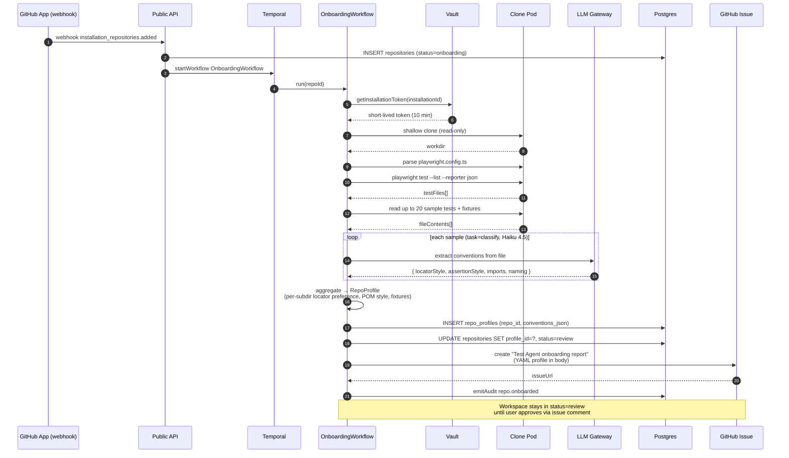
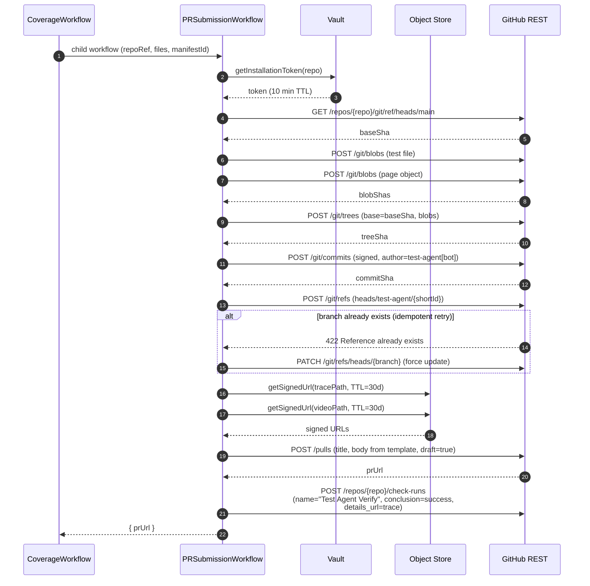
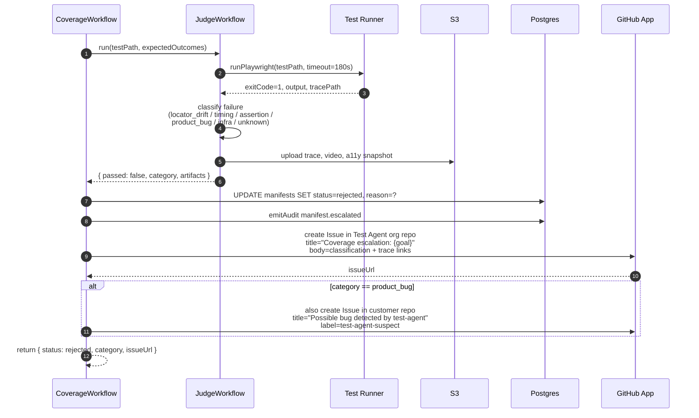
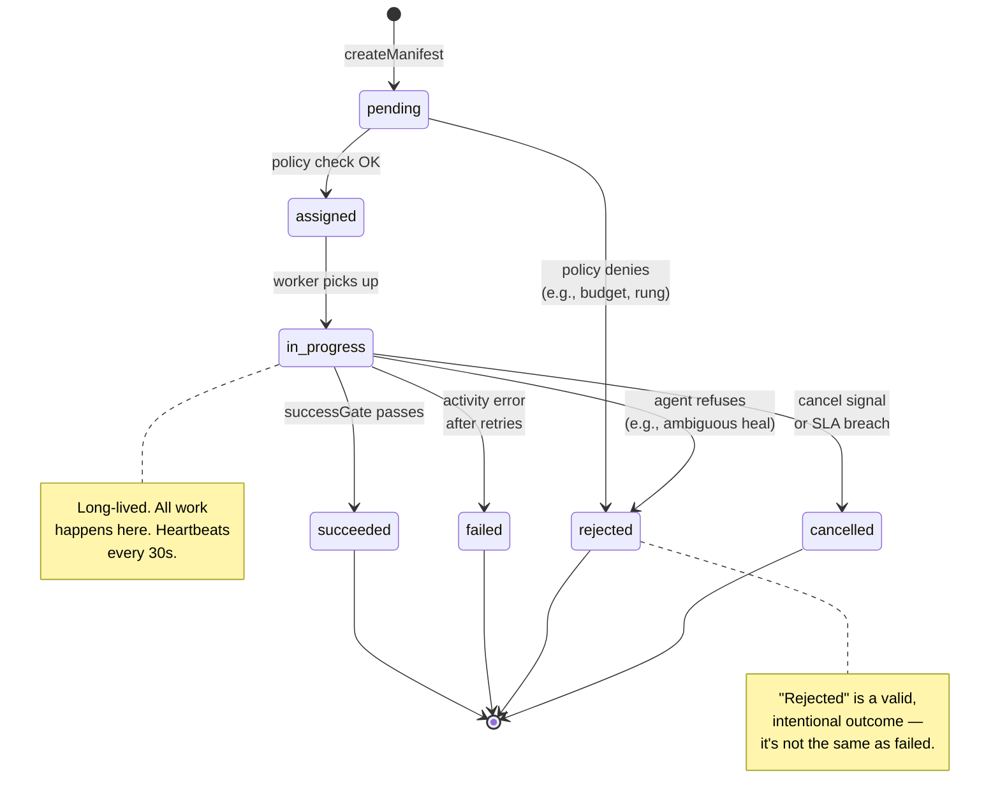
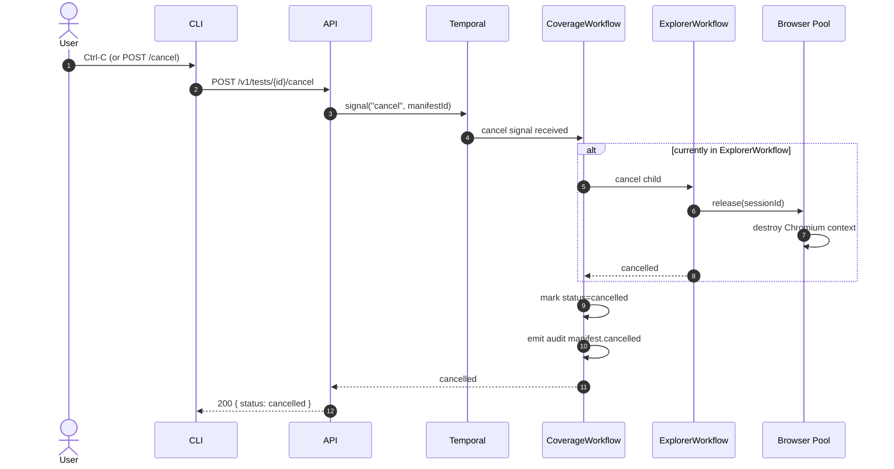

# Q1 Sequence & State Diagrams

Companion to [Q1-TECHNICAL-DESIGN.md](./Q1-TECHNICAL-DESIGN.md). All diagrams use Mermaid and render natively in GitHub, VS Code, and most doc viewers.

## Conventions

- **Actors** are proper nouns: `User`, `CLI`, `API`, `Temporal`, `CoverageWorkflow`, etc.
- **Participants with lifelines** are services; **notes** capture policy or invariants.
- **Solid arrows** = synchronous / RPC. **Dashed arrows** = async / responses.
- **Alt / opt / loop** blocks show branching explicitly — no "happy path only" diagrams.
- Every workflow starts by writing an `audit_log` row and tagging OTel spans with `manifest.id` and `correlation_id`.

Contents:
1. [Coverage — end to end](#1-coverage--end-to-end)
2. [Browser session lifecycle](#2-browser-session-lifecycle)
3. [LLM Gateway — cost meter, redaction, fallback](#3-llm-gateway--cost-meter-redaction-fallback)
4. [Repo Onboarding — profile extraction](#4-repo-onboarding--profile-extraction)
5. [PR Submission](#5-pr-submission)
6. [Judge failure → escalation](#6-judge-failure--escalation)
7. [Manifest state machine](#7-manifest-state-machine)
8. [Signals — cancel & pause](#8-signals--cancel--pause)

---

## 1. Coverage — end to end

The primary happy path for "add a test." Numbered activities correspond to §5 of the design doc.

```mermaid
sequenceDiagram
  autonumber
  actor User
  participant CLI as test-agent CLI
  participant API as Public API
  participant Temp as Temporal Cloud
  participant CW as CoverageWorkflow
  participant EW as ExplorerWorkflow
  participant GW as GeneratorWorkflow
  participant JW as JudgeWorkflow
  participant PG as Postgres (RLS)
  participant BP as Browser Pool
  participant LLM as LLM Gateway
  participant TR as Test Runner
  participant GH as GitHub App

  User->>CLI: test-agent add "…" --url … --repo …
  CLI->>API: POST /v1/tests { goal, url, repoId, expectedOutcomes }
  API->>PG: SET LOCAL app.workspace_id ; check budget + RLS
  API->>Temp: startWorkflow CoverageWorkflow
  Temp-->>API: workflowId
  API-->>CLI: 202 { manifestId, workflowId, correlationId }

  Temp->>CW: run(input)
  CW->>PG: INSERT manifests (status=pending)
  CW->>PG: emitAudit manifest.created

  CW->>CW: probeTarget(url)
  CW->>PG: loadRepoProfile(repoRef)
  alt profile missing
    CW-->>API: reject(repo_not_onboarded)
  end

  CW->>EW: child workflow (goal, url, expectedOutcomes)
  EW->>BP: startBrowserSession(manifestId)
  BP-->>EW: sessionId (from warm pool)
  EW->>LLM: system + user prompt (Stagehand instructions)
  LLM-->>EW: agent step plan
  loop until done or maxSteps
    EW->>BP: page.act(step)
    BP-->>EW: observation
  end
  EW->>BP: captureAriaSnapshot()
  BP-->>EW: ariaSnapshot
  EW->>EW: verify expectedOutcomes on final a11y tree
  alt outcomes not verified
    EW-->>CW: { verified: false, reasons }
    CW-->>API: reject(outcomes_not_verified)
  end
  EW-->>CW: { verified: true, actions, tracePath }

  CW->>GW: child workflow (profile, exploration, goal)
  GW->>PG: ragSelectExamples(repoRef, goal, k=3)
  GW->>GH: readRepoFiles(paths)
  GH-->>GW: file contents
  GW->>LLM: composed prompt (Sonnet 4.6, task=generate)
  LLM-->>GW: { testCode, pageObjectCode }
  GW->>GW: static-check (tsc, playwright test --list)
  GW-->>CW: { testPath, pageObjectPath }

  CW->>JW: child workflow (testPath, expectedOutcomes)
  JW->>TR: runPlaywright(testPath)
  TR-->>JW: { exitCode, tracePath, videoPath }
  JW->>JW: AST-check assertions match expectedOutcomes
  alt failed
    JW-->>CW: { passed: false }
    CW-->>API: escalate(test_did_not_pass) with artifacts
  end
  JW-->>CW: { passed: true, tracePath }

  CW->>GH: openPR(branch, files, body)
  GH-->>CW: { prUrl }
  CW->>PG: UPDATE manifests SET status=succeeded
  CW->>PG: emitAudit manifest.succeeded
  CW-->>API: succeeded { prUrl }

  API-->>User: GitHub notification (new PR)
```

**Invariants:**
- Every step above logs a `correlation_id`-tagged OTel span.
- `probeTarget`, `readRepoFiles`, `openPR` are all Temporal activities with `max=3` retries.
- `runPlaywright` runs in a Firecracker/gVisor-isolated pod. No host access.
- Sonnet 4.6 is the primary; on `429/5xx`, Gateway falls back to GPT-4o transparently (see §3).

---

## 2. Browser session lifecycle

Every session belongs to exactly one manifest, is never reused across tenants, and is torn down on completion or TTL.

```mermaid
sequenceDiagram
  autonumber
  participant EW as ExplorerWorkflow
  participant Redis
  participant Pod as BrowserPod (gVisor)
  participant EB as Egress Broker
  participant Target as Target App

  EW->>Redis: LPOP pool:idle
  Redis-->>EW: sessionId (or nil)

  alt no idle session
    EW->>EW: sleep 500ms; retry (max 30s)
    Note over EW: HPA scales Browser Pool<br/>when queue depth > 5 for 30s
  end

  EW->>Redis: SET pool:busy:{sid} EX 900 (TTL 15 min)
  EW->>Pod: attach(sessionId, manifestId)
  Pod->>Pod: allocate egress allowlist<br/>from target host + subresources
  Pod->>Pod: create Chromium context<br/>(read-only rootfs, emptyDir /tmp)

  loop each Stagehand action
    Pod->>EB: outbound HTTP request
    alt host in allowlist
      EB->>Target: forward
      Target-->>EB: response
      EB-->>Pod: response
    else host not allowed
      EB-->>Pod: 403 (logged: manifest, host)
    end
  end

  alt normal completion
    EW->>Pod: release(sessionId)
    Pod->>Pod: destroy Chromium context
    Pod->>Redis: DEL pool:busy:{sid}
    Note over Pod: pod itself keeps running;<br/>new session on next request
  else TTL expires
    Redis-->>Pod: expiry notification (Keyspace)
    Pod->>Pod: kill Chromium; drain
    Pod->>Redis: DEL pool:busy:{sid}
    Note over Pod: pod restarts to<br/>guarantee clean state
  end
```

**Guarantees:**
- gVisor prevents kernel escape from a compromised Chromium.
- Egress Broker default-deny prevents SSRF to internal AWS metadata / private VPC.
- `emptyDir` + read-only rootfs means no persistence between sessions.
- Pod restart on TTL expiry is a defense-in-depth check even if `destroy` didn't clean up.

---

## 3. LLM Gateway — cost meter, redaction, fallback

Every LLM call routes through the Gateway. No agent has direct provider credentials.

```mermaid
sequenceDiagram
  autonumber
  participant W as Worker (activity)
  participant GW as LLM Gateway
  participant Redis
  participant PG as Postgres
  participant DLP as PII Redactor
  participant Anth as Anthropic
  participant OAI as OpenAI

  W->>GW: POST /v1/complete { workspaceId, taskClass, prompt, ...}
  GW->>Redis: GET cost:{ws}:{today}:*
  Redis-->>GW: current_day_usd
  GW->>PG: SELECT daily_usd FROM budgets WHERE workspace_id=?

  alt current_day_usd + estimated > daily_usd
    GW-->>W: 429 BudgetExceeded (non-retryable)
    Note over W: activity fails;<br/>workflow escalates
  end

  GW->>DLP: redact(prompt, tenantRegexes)
  DLP-->>GW: redactedPrompt

  GW->>GW: pick primary by taskClass<br/>(generate → Sonnet 4.6)
  GW->>Anth: POST /messages
  alt Anthropic 200 OK
    Anth-->>GW: response { tokens, content }
  else 429 / 5xx / timeout
    GW->>OAI: POST /chat/completions (fallback)
    OAI-->>GW: response
  end

  GW->>GW: compute cost_usd from tokens
  GW->>Redis: INCRBYFLOAT cost:{ws}:{today}:{provider}:{model}
  GW->>PG: INSERT llm_calls (workspace_id, provider, model, tokens, cost, latency, task_class)

  GW-->>W: 200 { content, usage: { tokens, cost_usd, provider, model } }
```

**Notes:**
- Redaction happens **before** the prompt is logged, ever. Post-redaction prompts are stored for eval / debug; raw prompts are never persisted.
- Budget check is pre-call; overrun cannot happen from a single call.
- Fallback is provider-level; if both providers fail, the activity fails and workflow retries (up to 3) then escalates.
- `llm_calls` is RLS-scoped by `workspace_id`.

---

## 4. Repo Onboarding — profile extraction

Fires on `installation_repositories.added`. Produces a `RepoProfile` that every future generation prompt consumes.



**User closes the loop** by commenting `@test-agent confirm` on the issue → webhook flips workspace `status=active` and enables `POST /v1/tests` for that repo.

---

## 5. PR Submission

Isolated because it's the only step that mutates the customer's repo. Fully idempotent — retries are safe.



**Idempotency:** the branch name embeds `manifest.id.slice(0, 8)`. Retrying `openPR` on the same manifest reuses the branch and force-updates the ref — no duplicate PRs.

---

## 6. Judge failure → escalation

Q1 explicitly does not heal. When Judge says "no," the workflow packages everything and escalates.



**Design partner UX:** the escalation issue in our org repo is what the on-call SDET picks up during alpha. Once Triage lands in Q2, this issue becomes the input to a Triage manifest.

---

## 7. Manifest state machine

Every manifest — Coverage, Explorer, Generator, Judge — obeys this state machine. Enforced in the workflow code and validated on every write.



**Invariants:**
- Terminal states (`succeeded`, `failed`, `rejected`, `cancelled`) never transition.
- Every transition writes a `manifest_events` row with the previous status, next status, actor, and reason.
- Trust-rung enforcement happens on `pending → assigned` (via `enforcePolicy` activity in Q1; via OPA in Q2).

---

## 8. Signals — cancel & pause

Cancellation must be prompt and clean. A user hitting Ctrl-C in the CLI or clicking "Cancel" in a future dashboard triggers this.



**Pause** works the same way but with a `pause` signal — the workflow enters a `sleeping` state until a `resume` signal arrives. Used for the future Slack `@test-agent pause` command.

---

## Appendix: reading these under load

When triaging an incident, follow this order:

1. Find the `correlation_id` in the customer's report or PR comment
2. `SELECT * FROM manifests WHERE audit->>'correlationId' = '...'` — see the manifest tree
3. Grafana → filter traces by `correlation_id` — you get every span across every workflow, activity, LLM call, browser action
4. If a specific step failed: `SELECT * FROM manifest_events WHERE manifest_id = ? ORDER BY ts` — the full state history

The diagrams above are the ground truth for what *should* have happened. If Grafana disagrees, the code diverged from the design — file an issue against the design doc first, then fix the code.
